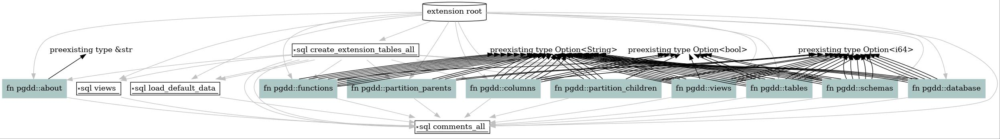

# PgDD Advanced installation

This page covers installing PgDD from source locally, and the Docker build
method based on [ZomboDB's build system](https://github.com/zombodb/zombodb)
used to create the binaries.


## Install `pgdd` from source


One way to install `pgdd` is to install from source by cloning this repository.

### Prereqs

pgrx and its dependencies are the main prereq for PgDD.
Install Prereqs and ensure PostgreSQL dev tools are installed.

> See the [Cargo pgrx](https://github.com/zombodb/pgrx/tree/master/cargo-pgrx)
documentation for more information on using pgrx.


```bash
sudo apt install postgresql-server-dev-all libreadline-dev zlib1g-dev curl \
    libssl-dev llvm-dev libclang-dev clang \
    graphviz
```

[Install Rust](https://www.rust-lang.org/tools/install) and pgrx.

```bash
curl https://sh.rustup.rs -sSf | sh -s -- -y
source $HOME/.cargo/env
```

Install `cargo-pgrx` regularly (see dev steps below for non-standard install).


```bash
cargo install --locked cargo-pgrx
```


Install `cargo-deb` used for packaging binaries.

```bash
cargo install cargo-deb
```


Initialize pgrx.  Need to run this after install AND occasionally to get updates
to Postgres versions or glibc updates.  Not typically required to follow pgrx
developments.


```bash
cargo pgrx init
```


### Clone PgDD repo

```bash
mkdir ~/git
cd ~/git
git clone https://github.com/rustprooflabs/pgdd.git
cd ~/git/pgdd
```

### Test deployment

Specify version, `pg10` through `pg13` are currently supported. This command will
start a test instance of Postgres on port `28812`.  Using a different version
changes the last two digits of the port!


```bash
cargo pgrx run pg14
```

The output starts with something similar to:

```bash
building extension with features `pg14`
"cargo" "build" "--lib" "--features" "pg14" "--no-default-features"
    Updating crates.io index
```


```bash
     Copying control file to `/home/username/.pgrx/14.0/pgrx-install/share/postgresql/extension/pgdd.control`
     Copying shared library to `/home/username/.pgrx/14.0/pgrx-install/lib/postgresql/pgdd.so`
    Building SQL generator with features `pg14`
"cargo" "build" "--bin" "sql-generator" "--features" "pg14" "--no-default-features"
   Compiling pgdd v0.4.0 (/home/username/git/pgdd)
    Finished dev [unoptimized + debuginfo] target(s) in 13.84s
 Discovering SQL entities
  Discovered 9 SQL entities: 0 schemas (0 unique), 6 functions, 0 types, 0 enums, 3 sqls, 0 ords, 0 hashes
running SQL generator with features `pg14`
"cargo" "run" "--bin" "sql-generator" "--features" "pg14" "--no-default-features" "--" "--sql" "/home/username/.pgrx/14.0/pgrx-install/share/postgresql/extension/pgdd--0.4.1-dev.sql"
    Finished dev [unoptimized + debuginfo] target(s) in 0.06s
     Running `target/debug/sql-generator --sql /home/username/.pgrx/14.0/pgrx-install/share/postgresql/extension/pgdd--0.4.1-dev.sql`
     Copying extension schema file to `/home/username/.pgrx/14.0/pgrx-install/share/postgresql/extension/pgdd--0.4.1-dev.sql`
    Finished installing pgdd
    Starting Postgres v14 on port 28814
    Re-using existing database pgdd
```

In the test instance of psql, create the extension in database.

```bash
CREATE EXTENSION pgdd;
```

> Note: When you see "Re-using existing database pgdd" your previous installed version of `pgdd` will be available. To ensure you are working with the latest version of the `pgdd` extension you must drop/create the extension, quit the psql shell, and re-run the `cargo pgrx run` command.


## Build binary packages

Debian/Ubuntu Bionic binaries are available for 0.4.0
(first [pgrx](https://github.com/tcdi/pgrx) version)
and later.  More distributions will likely have binaries available in the future.


```bash
cd build/
time bash ./build.sh
```

Tagged versions will be attached to their [releases](https://github.com/rustprooflabs/pgdd/releases).

During development some versions may be copied to the `./standalone/` directory.

```bash
cp ./target/artifacts/* ./standalone/
```

## pgrx Generate graphviz

```bash
cargo pgrx schema -d pgdd.dot
dot -Goverlap=prism -Gspline=ortho -Tjpg pgdd.dot > pgdd.jpg
```




## Non-standard dev

When working against pgrx installed from a non-tagged branch, install pgrx using:

```bash
cargo install --locked --force --git "https://github.com/tcdi/pgrx" \
    --branch "develop" \
    "cargo-pgrx"
```


The following command can be used to force pgrx to overwrite the configs it needs to
for various dev related changes.

Clean things out.

```bash
cargo clean
```

If you're doing the above, you probably should remove the `Cargo.lock`
file while you're at it.  The more cautious may want to move it aside for a backup.

```bash
rm Cargo.lock
```

Force build the schema.


```bash
cargo pgrx schema -f
```


## Non-standard In Docker

If testing this extension against non-standard pgrx install, update the
Dockerfile to install from the specific branch.

Change

```bash
RUN /bin/bash rustup.sh -y \
    && cargo install --locked cargo-pgrx
```

To

```bash
RUN /bin/bash rustup.sh -y \
    && cargo install --locked --force --git "https://github.com/tcdi/pgrx" \
        --branch "develop" \
        "cargo-pgrx"
```

